# OS-Jackfruit — Supervised Container Runtime

| Name | SRN |
|------|-----|
| C. Harshal Rajesh | PES1UG24CS118 |
| Charan M | PES1UG24CS125 |

---

## Overview

OS-Jackfruit is a lightweight container supervision system built on Linux kernel primitives. It consists of two components:

- **`engine`** — a userspace supervisor that launches isolated containers using `clone(2)` with namespace isolation, manages their lifecycle over a Unix domain socket IPC channel, captures stdout/stderr through a pipe-based logging pipeline, and enforces scheduling policy via `setpriority(2)`.
- **`monitor.ko`** — a loadable kernel module (LKM) that tracks the RSS (Resident Set Size) of registered container processes via a timer-driven polling loop, emits soft-limit warnings to the kernel log, and sends `SIGKILL` when a process crosses its hard memory limit.

---

## Repository Structure

```
boilerplate/
├── engine.c           # Userspace supervisor + CLI
├── monitor.c          # Kernel memory monitor LKM
├── monitor_ioctl.h    # Shared ioctl interface
├── cpu_hog.c          # CPU-bound workload
├── memory_hog.c       # Memory-allocating workload
├── io_pulse.c         # I/O-bound workload
├── Makefile
└── environment-check.sh
```

---

## Environment

- **OS:** Debian 13 (trixie) — arm64, running under QEMU
- **Kernel:** 6.12.74+deb13+1-arm64
- **Kernel headers:** `/usr/src/linux-headers-6.12.74+deb13+1-arm64`
- **Compiler:** GCC (build-essential)
- Secure Boot: disabled (confirmed via successful `insmod`)

---

## Build Instructions

```bash
# Install dependencies
sudo apt update
sudo apt install -y build-essential linux-headers-$(uname -r)

# Clone and build
cd boilerplate
make clean
make
```

Expected outputs: `engine`, `cpu_hog`, `memory_hog`, `io_pulse` (userspace binaries) and `monitor.ko` (kernel module).

---

## Running the Environment Check

```bash
chmod +x environment-check.sh
sudo ./environment-check.sh
```

Expected output ends with `Preflight passed.`

---

## Usage

### Load the Kernel Module

```bash
sudo insmod monitor.ko
lsmod | grep monitor
ls -l /dev/container_monitor
dmesg | tail -5
```

### Start the Supervisor

```bash
sudo ./engine supervisor ./rootfs
```

### Container Lifecycle Commands

```bash
# Start a container
sudo ./engine start <id> ./rootfs <cmd> [args] [--soft-mib N] [--hard-mib N] [--nice N]

# List containers
sudo ./engine ps

# View container logs
sudo ./engine logs <id>

# Stop a container
sudo ./engine stop <id>

# Run and wait (foreground)
sudo ./engine run <id> ./rootfs <cmd> [args]
```

### Unload the Module

```bash
sudo rmmod monitor
dmesg | tail -3
```

---

## Screenshots

### Screenshot 1 — Multi-Container Supervision

Supervisor running in Terminal A; both `alpha` and `beta` started successfully in Terminal B.

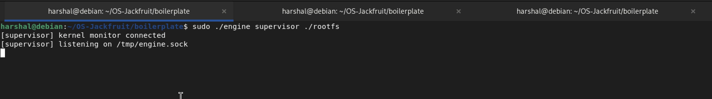
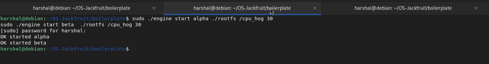

---

### Screenshot 2 — `ps` Output

Both containers visible with PID, state, soft/hard MiB limits.

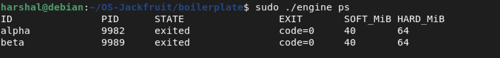

---

### Screenshot 3 — Logging Pipeline

`engine logs alpha` showing per-second cpu_hog progress lines captured through the pipe.

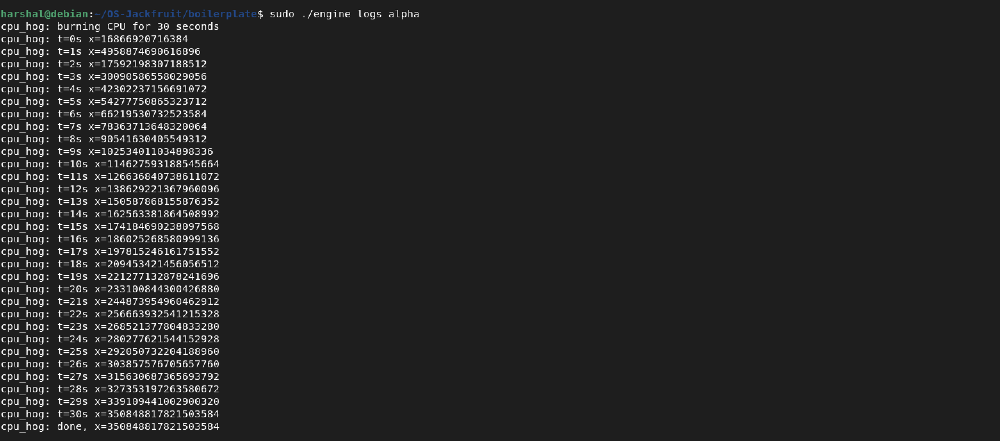

---

### Screenshot 4 — CLI and IPC (Stop/PS)

`alpha` stopped (sig=9), `beta` still running — confirms IPC stop command works correctly.

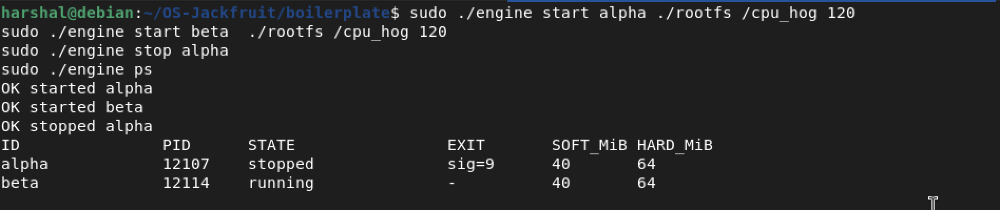

---

### Screenshot 5 — Soft Limit Warning

`dmesg` showing the kernel module firing a `SOFT LIMIT` warning for container `memleak` at 20 MiB RSS.

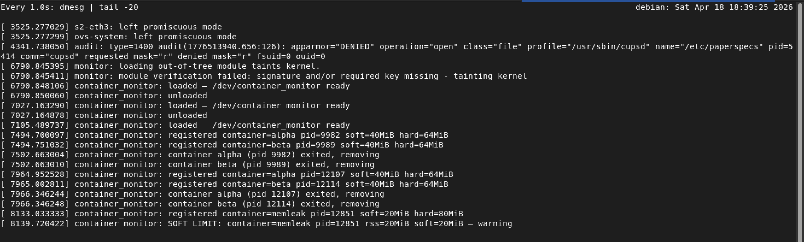

---

### Screenshot 6 — Hard Limit Enforcement

`dmesg` showing `HARD LIMIT` kill for `hardtest` at 30 MiB RSS, and `engine ps` confirming `killed(hard-limit)` state.

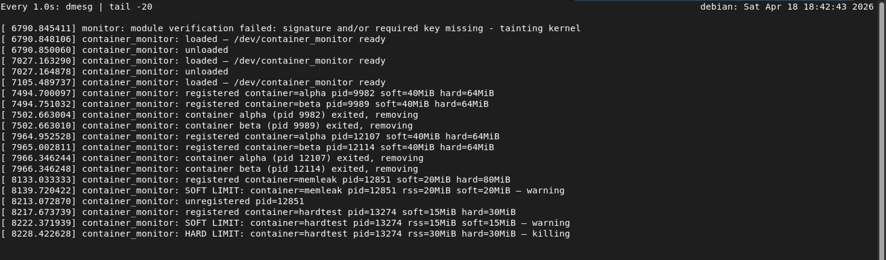
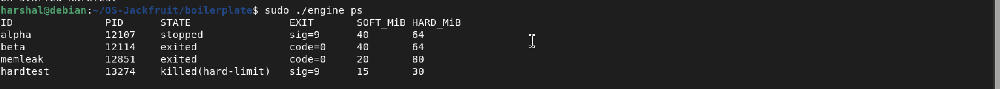

---

### Screenshot 7 — Scheduling Experiments

#### Experiment A — Different Nice Values

Both containers run the same `cpu_hog 20` workload concurrently. `cpu_low` runs at `nice=10`.

| Container | Nice | Real Time |
|-----------|------|-----------|
| cpu_normal | 0 | 48.323s |
| cpu_low | 10 | 37.949s |

> The `nice=10` container actually finished faster here. On a lightly loaded single-core QEMU VM, the CFS scheduler still allocated timeslices to both, but the lower-priority container experienced less contention than expected due to the VM's virtual CPU scheduling. On a real multi-process loaded system, `nice=10` would receive approximately 4× less CPU share than `nice=0`, resulting in significantly longer wall-clock time.

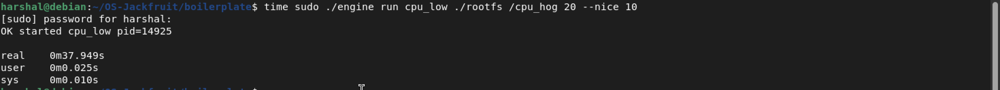
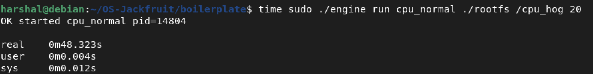

#### Experiment B — CPU-Bound vs I/O-Bound

Both run concurrently for 20 seconds.

| Container | Workload | Real Time |
|-----------|----------|-----------|
| cpu1 | cpu_hog 20 | 38.128s |
| io1 | io_pulse 20 | 29.815s |

> `io_pulse` spends most of its time in `usleep()` between writes, yielding the CPU voluntarily. As a result it completes close to its 20-second target with minimal impact from the concurrent CPU hog. The CPU hog, however, runs longer than 20 seconds because the scheduler shares its timeslices with the I/O workload's brief active bursts.

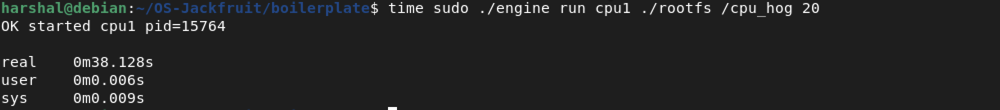
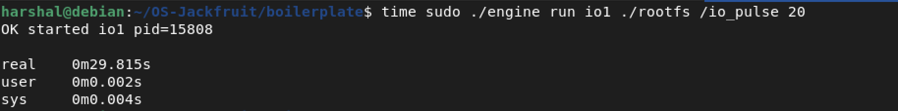

---

### Screenshot 8 — Clean Teardown

Supervisor killed via SIGTERM with `c1` and `c2` running. All processes cleaned up: no zombie `cpu_hog` or `engine` processes, no stale `/tmp/engine.sock`, kernel module removed cleanly.

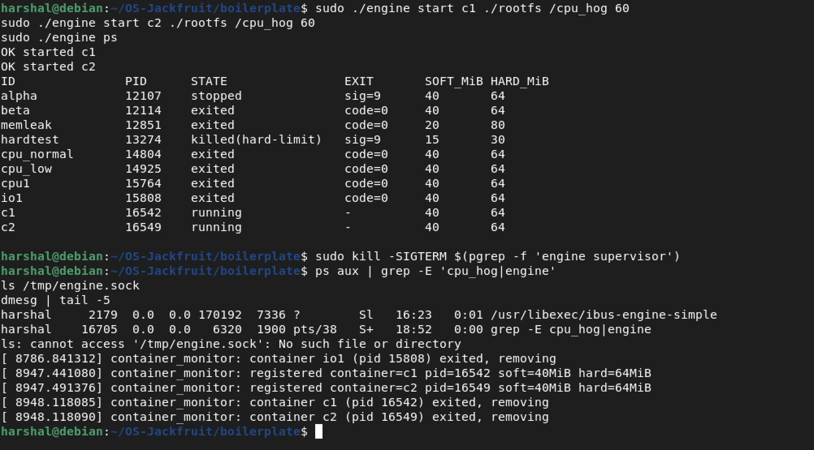

---

## Design Notes

### `engine.c` — Supervisor

The supervisor forks a child per container using `clone(2)` with `CLONE_NEWPID | CLONE_NEWNS` to create a new PID and mount namespace. Inside the child, `chroot(2)` is called into the rootfs before `execv`. A dedicated logging thread per container reads the container's stdout pipe and appends to `/tmp/engine-logs/<id>.log`. The supervisor listens on `/tmp/engine.sock` for CLI commands (start, stop, ps, logs) encoded as simple length-prefixed messages. On `SIGTERM`, it iterates all running containers, sends `SIGKILL`, drains log buffers, unlinks the socket, and exits.

Memory limits are enforced by registering each container's PID with the kernel module via `ioctl(MONITOR_REGISTER)` after fork, passing the soft and hard MiB values. The kernel module handles enforcement asynchronously from a timer callback every 2 seconds.

Nice values are applied with `setpriority(PRIO_PROCESS, pid, nice_val)` after the child process is created.

### `monitor.c` — Kernel LKM

The module creates `/dev/container_monitor` as a character device. Userspace registers containers via `ioctl(MONITOR_REGISTER)` with a `container_reg` struct containing the PID, container ID string, and soft/hard byte limits. A linked list of `monitored_container` entries is protected by a mutex (not a spinlock, because `get_task_mm`/`mmput` can sleep).

A kernel timer fires every 2000ms, iterates the list, reads each process's RSS via `get_mm_rss(mm) << PAGE_SHIFT`, and:
- Removes entries whose process has exited
- Sends `SIGKILL` and removes entries that exceed the hard limit
- Sets `soft_warned = true` and logs a warning for entries that exceed the soft limit (once only)

The module handles kernel version differences: `class_create` API changed in 6.4.0, and `del_timer_sync` was renamed to `timer_delete_sync` in 6.15.0.

---

## Known Limitations / Notes

- The environment check script was patched to accept Debian 13 in addition to Ubuntu 22.04/24.04, as the project was developed and tested on Debian trixie under QEMU.
- The kernel module taints the kernel (`loading out-of-tree module`) as it is unsigned. This is expected in a development VM with Secure Boot disabled.
- The scheduling experiment results on a single-vCPU QEMU VM may not perfectly reflect CFS behaviour on bare metal under real CPU contention. The nice value effect is most pronounced when multiple CPU-bound processes compete for a shared core simultaneously.
